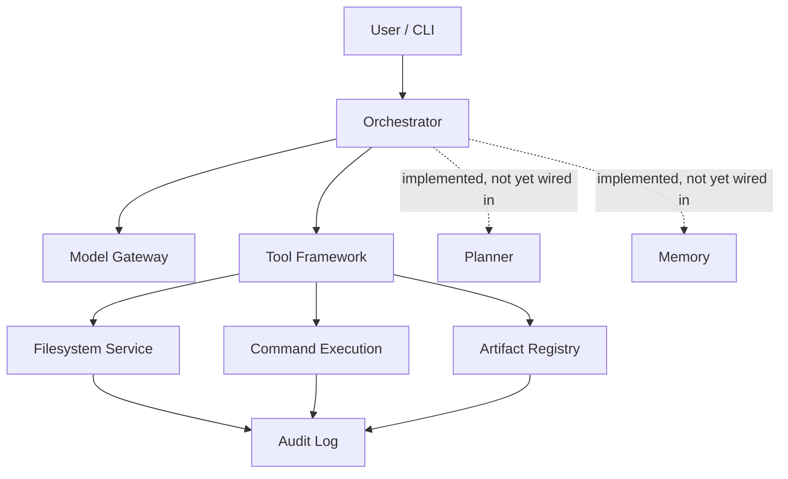

<div align="center">

<br/>

# Qwen3CoderNext

### A local-first coding agent framework — Codex-style repository automation, without handing your codebase to a black box.

<br/>

**Your repo. Your machine. Your rules.**

<br/>

[](https://github.com/neural-agi/qwen3codernext)
[](https://github.com/neural-agi/qwen3codernext/tree/main/tests)
[](https://python.org)
[](LICENSE)
[](https://github.com/astral-sh/uv)

<!-- TODO: Add CI badge once GitHub Actions is configured -->

<br/>

**[🤔 Why This Exists](#-why-this-exists) · [✨ What Makes It Different](#-what-makes-it-different) · [🏗 Architecture](#-architecture-overview) · [📦 Install](#-installation) · [🗺 Roadmap](#-roadmap) · [🤝 Contributing](#-contributing)**

</div>

---

## 🤔 Why This Exists

Every major AI coding agent forces the same trade-off: ship your repository to a vendor's cloud, or give up autonomous workflows entirely.

That trade-off is unnecessary. And it's expensive:

- Your code — env vars, internal tooling, proprietary logic — leaves your machine
- Execution is opaque. You can't audit what the agent actually did to your codebase
- You're locked to one provider's roadmap, pricing, and uptime
- Most agent codebases calcify into unmaintainable spaghetti before the approach is even proven

**Qwen3CoderNext exists because "autonomous" and "auditable" shouldn't be opposites.**

It's a coding agent foundation built on infrastructure you control, where every read, write, and command is logged, checksummed, and replayable — before any autonomous behavior is layered on top.

---

## ✨ What Makes It Different

|  | Typical Cloud Coding Agents | Qwen3CoderNext |
|---|---|---|
| **Where it runs** | Vendor's cloud | Your machine / your infra |
| **Execution visibility** | Opaque | Append-only, sequence-numbered audit log |
| **Repo boundaries** | Implicit, trust-based | Explicitly enforced |
| **Generated files** | Ephemeral | Checksum-verified, versioned, provenance-tracked |
| **Provider lock-in** | High | Model-gateway abstraction — swap providers freely |
| **Build philosophy** | Ship autonomy, bolt on reliability later | Deterministic infrastructure first, intelligence layered on top |

---

## 🔑 Key Features

- **Local-first execution** — your repository and credentials never have to leave your machine
- **Enforced workspace boundaries** — the agent physically can't wander outside the repo it's working in
- **Safe, reversible file operations** — reads, patches, and writes go through a controlled pipeline, not raw filesystem access
- **Full audit trail** — every action is append-only logged and replayable, so you always know what happened and why
- **Provenance-tracked artifacts** — every generated file is checksum-verified with a supersede history, never silently overwritten
- **Provider-independent model gateway** — change models without rearchitecting your workflow
- **Built to be understood** — modular, contract-driven components instead of one sprawling agent loop

---

## 🏗 Architecture Overview



> **Solid lines** = built, integrated, and tested today.
> **Dashed lines** = real implementations exist (`simple_planner`, memory `manager` + `store`) but aren't driving execution yet — integration is the active work under Agent Core.

**Component breakdown:**

| Component | Role | Status |
|---|---|---|
| **Orchestrator** | Coordinates tool execution; will route through planner + memory post–Agent Core | ✅ |
| **Model Gateway** | Routes requests to any supported provider; swap models without touching workflow | ✅ |
| **Tool Framework** | Contract layer every tool implements; includes `echo_tool` + full registry/manager | ✅ |
| **Filesystem Service** | Enforces workspace boundaries; safe reads, controlled writes, diffs | ✅ |
| **Artifact Registry** | Tracks every generated file with checksums, provenance, supersede history | ✅ |
| **Audit Log** | Append-only, sequence-numbered record of every agent action | ✅ |
| **Planner** | `simple_planner.py` — implemented and tested; awaiting orchestrator integration | 🔜 |
| **Memory** | `manager.py` + `store.py` — implemented and tested; awaiting integration | 🔜 |

---

## 📊 Current Status

### ✅ Foundation Layer — Complete

- Core contracts (artifact, model, runtime, state, task)
- Configuration system (settings, loader, defaults)
- Structured logging infrastructure
- State management (manager, store)
- Model gateway and adapter layer
- Runtime context and orchestrator shell
- Artifact manager and store
- Prompt infrastructure (contracts, loader, registry)
- Evaluation foundation

### ✅ Local Tooling Layer — Complete

- Workspace resolution and boundary enforcement
- Filesystem service abstraction
- Safe file reads, writes, and patch application
- Diff generation
- Command execution
- Artifact registry
- Audit logging
- Tool adapter integration

### ✅ Planning & Memory Foundation — Complete

- Planning contracts, planner, `simple_planner` — implemented and tested
- Memory contracts, manager, store — implemented and tested

### 🚧 Agent Core — In Progress

- Wiring planner and memory into the orchestrator
- Building real task execution
- First real CLI entrypoint

---

## 🎯 Target Experience

> *Agent Core is not yet complete. This is the full intended workflow once it lands.*

```
You: "Refactor the auth module to use the new session interface."
          │
          ▼
  Orchestrator → Planner breaks task into steps
          │
          ▼
  Filesystem Service reads relevant files
  (inside enforced workspace boundary ✅)
          │
          ▼
  Patch generated → applied through controlled write pipeline
          │
          ▼
  Every read, write & command → Audit Log with checksums
          │
          ▼
  You receive: reviewable diff + full provenance chain
  → nothing touches main until you approve
```

---

## 📦 Installation

```bash
git clone https://github.com/neural-agi/qwen3codernext.git
cd qwen3codernext
uv sync
```

---

## 🧪 Quick Start

The fastest way to verify the foundation is solid while Agent Core is being built:

```bash
uv run python -m unittest discover -s tests -v
```

**104 tests. Zero failures.**

| Test Tier | Files | Coverage |
|---|---|---|
| `tests/smoke/` | 23 files | One per module — contracts, config, logging, state, model gateway, orchestrator, artifacts, all 10 local tooling submodules, memory, planning, prompts, runtime |
| `tests/unit/` | 8 files | Deep coverage on `local_tooling` — reads, mutations, diff, commands, audit, artifact registry, resolution, adapter |
| `tests/integration/` | 1 file | Local tooling adapter end-to-end |

---

## 📁 Repository Structure

```
Qwen-3-Coder-Next/
├── src/qwen3_coder_next/
│   ├── __main__.py              # CLI entry point
│   ├── adapters/                # model gateway, base adapter, exceptions
│   ├── artifacts/               # artifact manager and store
│   ├── bootstrap/               # app bootstrap, runtime initialization
│   ├── config/                  # settings, loader, defaults
│   ├── contracts/               # core type contracts — artifact, model, runtime, state, task
│   ├── evaluation/              # evaluation contracts, evaluator, simple_evaluator
│   ├── execution/               # executor and result types
│   ├── local_tooling/           # most complete module (10 files)
│   │                            # filesystem, reads, operations, diff, commands,
│   │                            # artifact_registry, audit, resolution, adapter, contracts
│   ├── logging/                 # formatter, logger, setup
│   ├── memory/                  # contracts, manager, store — tested, not yet wired in
│   ├── planning/                # contracts, planner, simple_planner — tested, not yet wired in
│   ├── prompts/                 # contracts, loader, registry
│   ├── runtime/                 # orchestrator, runtime context
│   ├── state/                   # state manager and store
│   ├── tools/                   # contracts, registry, manager, echo_tool
│   └── utils/
│
├── tests/
│   ├── smoke/                   # 23 files — every module covered
│   ├── unit/                    # 8 files — local_tooling deep coverage
│   └── integration/             # local_tooling adapter integration
│
├── documents/                   # internal architecture docs
│   ├── architecture.md
│   ├── vision.md
│   ├── roadmap.md
│   ├── coding_standards.md
│   ├── progress.md
│   └── session_handoff.md
│
├── Roadmap and Module wise expansion/   # 15 PDFs — full Tier 3 roadmap
│   ├── Part 1: Foundation
│   ├── Part 2: Filesystem + Local Tooling
│   ├── ... (Parts 3–14)
│   └── Part 15: Near-Codex Integrated System
│
├── logs/                        # application.log — the system already runs
├── pyproject.toml, uv.lock
└── README.md
```

---

## 📚 Documentation

**`documents/`** — Internal architecture specifications, coding standards, progress tracking, and session context. Start here before touching code.

**`Roadmap and Module wise expansion/`** — 15 PDFs covering the complete Tier 3 roadmap from Foundation through Near-Codex Integrated System. If you want to understand the layering decisions, start with the master roadmap PDF.

---

## 🗺 Roadmap

| Layer | Focus | Status |
|---|---|---|
| Foundation | Contracts, config, logging, state, model gateway, orchestrator, artifacts | ✅ Complete |
| Local Tooling | Filesystem, reads/writes, commands, audit, artifact registry | ✅ Complete |
| Planning & Memory Foundation | Simple planner, memory manager/store — implemented and tested | ✅ Complete |
| **Agent Core** | **Planner + memory integration, real task execution, CLI** | **🚧 Active** |
| Advanced Planning | Multi-step decomposition, replanning, failure recovery | 📋 Planned |
| Memory Systems | Persistent context, session memory, cross-task recall | 📋 Planned |
| Tool Ecosystem | File tools, search tools, shell tools, extensible registry | 📋 Planned |
| Repository Intelligence | Codebase understanding, symbol graphs, dependency mapping | 📋 Planned |
| Autonomous Workflows | End-to-end task execution with human approval gates | 📋 Planned |
| Multi-Agent Architecture | Coordination, specialization, parallel execution | 📋 Planned |

The full 15-part roadmap is documented in `Roadmap and Module wise expansion/`.

---

## 👥 Who This Is For

**Privacy-conscious developers and teams** who can't or won't send proprietary code, internal tooling, or environment secrets to a third-party cloud agent.

**Teams under compliance constraints** — legal, financial, healthcare — where code leaving the machine isn't an option, but autonomous development workflows still are.

**OSS maintainers** who want reproducible, auditable automation in CI without a vendor dependency.

**Builders and researchers** who want a clean, contract-driven foundation to build agent behavior on top of — rather than forking an opinionated monolith and fighting its design assumptions.

---

## 🤝 Contributing

Qwen3CoderNext is early — contributing now means shaping the foundation, not just adding to it.

Read **[CONTRIBUTING.md](CONTRIBUTING.md)** for full setup instructions, coding guidelines, pull request expectations, and the project philosophy before opening anything.

**The short version:**
- Open an issue before large changes — architecture decisions need to stay consistent with existing contracts
- Tests are not optional — every subsystem has smoke, unit, and integration coverage; PRs that reduce coverage don't merge
- Read the relevant `documents/` spec and roadmap PDF for the module you're touching — it saves significant back-and-forth

**Where to contribute right now:**

| Area | What's Needed |
|---|---|
| 🚧 **Agent Core** | Planner integration, memory wiring, orchestrator task loop, CLI entrypoint — this is the active focus |
| 🧪 **Test coverage** | Additional unit and integration tests across all subsystems |
| 📚 **Documentation** | Architecture docs, setup guides, inline docstrings |

---

## 💡 Design Philosophy

> Most agent projects ship a capable-looking agent first and try to add reliability later. The result is an autonomous system that's hard to trust, hard to debug, and hard to extend — because the foundation wasn't built for those properties.

Qwen3CoderNext takes the opposite path: **deterministic, testable infrastructure first.** Every subsystem is validated before the next layer is added. Planning and memory implementations exist and are tested before they're integrated — not because that's the fastest path to a demo, but because it's the right way to build something you can actually trust.

The long-term target is a fully autonomous, multi-agent development platform — repository understanding, persistent memory, multi-model collaboration, human approval gates — that never asks you to give up visibility into what it's doing or where your code lives.

**104 tests passing. Every module covered. `application.log` already being written.**

That's the beginning, not the end.

---

## 📄 License

Qwen3CoderNext is licensed under the **MIT License**.

You're free to use, modify, distribute, and build upon this project in accordance with the terms of the license.

See the [LICENSE](LICENSE) file for the full license text.


---

<div align="center">

Built by [@neural-agi](https://github.com/neural-agi)

[](https://github.com/neural-agi/Qwen3-coder-next)
[](https://github.com/neural-agi/Qwen3-coder-next/fork)
[](https://github.com/neural-agi/Qwen3-coder-next)

</div>
