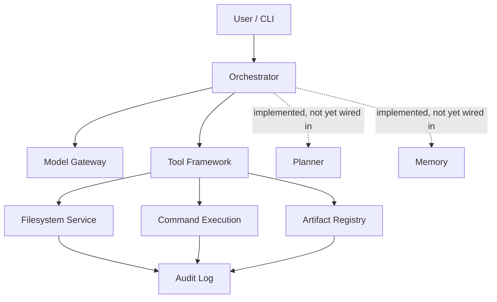

# Qwen3CoderNext

A local-first coding agent framework — Codex-style repository automation, without handing your codebase to a black box.

**Your repo. Your machine. Your rules.**


<!-- TODO: Add CI badge once GitHub Actions is set up -->
<!-- TODO: Add terminal GIF once Agent Core has a runnable end-to-end task -->

---

## Why This Exists

Most "AI coding agent" tools force a trade you shouldn't have to make: ship your repository to a vendor's cloud, or give up on autonomous workflows entirely.

- Your code — and everything around it, env vars, internal tools, proprietary logic — leaves your machine.
- Execution is opaque. You can't audit what the agent actually did to your codebase.
- You're betting your workflow on one provider's roadmap, pricing, and uptime.
- Agent codebases that start clean tend to calcify into unmaintainable spaghetti before anyone proves the approach actually works.

Qwen3CoderNext exists because "autonomous" and "auditable" shouldn't be opposites. It's a coding agent foundation built on infrastructure you control, where every read, write, and command is logged, checksummed, and replayable — before any autonomous behavior is layered on top.

## What Makes It Different

| | Typical Cloud Coding Agents | Qwen3CoderNext |
|---|---|---|
| **Where it runs** | Vendor's cloud | Your machine / your infra |
| **Execution visibility** | Opaque | Append-only, sequence-numbered audit log |
| **Repo boundaries** | Implicit, trust-based | Explicitly enforced |
| **Generated files** | Ephemeral | Checksum-verified, versioned, provenance-tracked |
| **Provider lock-in** | High | Model-gateway abstraction — swap providers freely |
| **Build philosophy** | Ship autonomy, bolt on reliability later | Deterministic infrastructure first, intelligence layered on top |

## Key Features

- **Local-first execution** — your repository and credentials never have to leave your machine.
- **Enforced workspace boundaries** — the agent physically can't wander outside the repo it's working in.
- **Safe, reversible file operations** — reads, patches, and writes go through a controlled pipeline, not raw filesystem access.
- **Full audit trail** — every action is append-only logged and replayable, so you always know what happened and why.
- **Provenance-tracked artifacts** — every generated file is checksum-verified with a supersede history, never silently overwritten.
- **Provider-independent model gateway** — change models without rearchitecting your workflow.
- **Built to be understood** — modular, contract-driven components instead of one sprawling agent loop.

## Architecture Overview



*Solid lines = built, integrated, and tested today. Dashed lines = real implementations exist (`simple_planner`, memory `manager` + `store`) but aren't driving execution yet — integration is the active work under Agent Core.*

**Components:**
- **Orchestrator** — coordinates tool execution; will route through planner and memory once Agent Core integration lands.
- **Model Gateway** — routes requests to any supported model provider; swap providers without touching your workflow.
- **Tool Framework** — contract layer every tool implements; includes a working `echo_tool` and full registry/manager.
- **Filesystem Service** — enforces workspace boundaries; safe reads, controlled writes, patch application, diff generation.
- **Artifact Registry** — tracks every generated file with checksums, provenance, and supersede history.
- **Audit Log** — append-only, sequence-numbered record of everything the agent did.
- **Planner** — `simple_planner.py` implementation exists and is tested; not yet integrated into the orchestrator.
- **Memory** — `manager.py` and `store.py` implementations exist and are tested; not yet integrated into the orchestrator.

## Current Status

**✅ Completed**

*Foundation Layer*
- Core contracts (artifact, model, runtime, state, task)
- Configuration system (settings, loader, defaults)
- Structured logging infrastructure
- State management (manager, store)
- Model gateway and adapter layer
- Runtime context and orchestrator shell
- Artifact manager and store
- Runtime bootstrap
- Execution framework
- Prompt infrastructure (contracts, loader, registry)
- Evaluation foundation (evaluator, simple_evaluator)

*Local Tooling Layer*
- Workspace resolution and boundary enforcement
- Filesystem service abstraction
- Safe file reads
- Filesystem operations and mutations
- Safe writes and patch application
- Diff generation
- Command execution
- Artifact registry
- Audit logging
- Tool adapter integration

*Planning & Memory Foundation*
- Planning contracts, planner, and `simple_planner` — implemented and tested
- Memory contracts, manager, and store — implemented and tested

**🚧 In Progress**
- Agent Core — wiring planner and memory into the orchestrator, building real task execution

**📋 Planned**
- Advanced Planning
- Memory Systems
- Tool Ecosystem
- Repository Intelligence
- Autonomous Development Workflows
- Multi-Agent Architecture

## What This Will Do

*The full agent workflow requires Agent Core — not available yet. This is the target experience.*

1. You describe a task: *"Refactor the auth module to use the new session interface."*
2. The orchestrator routes through the planner, which breaks the task into steps.
3. The filesystem service reads relevant files inside the enforced workspace boundary.
4. A patch is generated and applied through the controlled write pipeline.
5. Every step — every read, write, and command — lands in the audit log with checksums.
6. You get a reviewable diff and full provenance chain before anything touches your main branch.

## Installation

```bash
git clone https://github.com/<your-org>/qwen3codernext.git
cd qwen3codernext
uv sync
```

## Quick Start

```bash
uv run python -m unittest discover -s tests -v
```

104 tests across three tiers — smoke, unit, and integration — covering every major subsystem. Zero failures. This is the fastest way to see the foundation is solid while Agent Core is being built.

**Test coverage by tier:**
- `tests/smoke/` — 23 files, one per module. Covers contracts, config, logging, state, model gateway, orchestrator, artifacts, execution, evaluation, local tooling (all 10 submodules), memory foundation, planning foundation, prompt infrastructure, runtime bootstrap, tool framework.
- `tests/unit/` — 8 files, deep on local_tooling. Reads, mutations, diff, commands, audit, artifact registry, resolution, adapter.
- `tests/integration/` — local tooling adapter end-to-end.

## Repository Structure

```
Qwen-3-Coder-Next/
├── src/qwen3_coder_next/
│   ├── __main__.py              # CLI entry point
│   ├── adapters/                # model gateway, base adapter, exceptions
│   ├── artifacts/               # artifact manager and store
│   ├── bootstrap/               # app bootstrap, runtime initialization
│   ├── config/                  # settings, loader, defaults
│   ├── contracts/               # core type contracts — artifact, model, runtime, state, task
│   ├── evaluation/              # evaluation contracts, evaluator, simple_evaluator
│   ├── execution/               # executor and result types
│   ├── local_tooling/           # most complete module — 10 files
│   │                            # filesystem, reads, operations, diff, commands,
│   │                            # artifact_registry, audit, resolution, adapter, contracts
│   ├── logging/                 # formatter, logger, setup
│   ├── memory/                  # contracts, manager, store — implemented, not yet wired in
│   ├── planning/                # contracts, planner, simple_planner — implemented, not yet wired in
│   ├── prompts/                 # contracts, loader, registry
│   ├── runtime/                 # orchestrator, runtime context
│   ├── state/                   # state manager and store
│   ├── tools/                   # contracts, registry, manager, echo_tool
│   └── utils/
├── tests/
│   ├── smoke/                   # 23 files — every module covered
│   ├── unit/                    # 8 files — local_tooling deep coverage
│   └── integration/             # local_tooling adapter integration
├── documents/                   # internal architecture docs
│   ├── architecture.md
│   ├── vision.md
│   ├── roadmap.md
│   ├── coding_standards.md
│   ├── progress.md
│   └── session_handoff.md
├── Roadmap and Module wise expansion/   # 15 PDFs — full Tier 3 roadmap
│   ├── Part 1: Foundation
│   ├── Part 2: Filesystem + Local Tooling
│   ├── Part 3: Planning Layer
│   ├── Part 4: Research
│   ├── Part 5: Memory System
│   ├── Part 6: Testing and Review
│   ├── Part 7: Evaluation Layer
│   ├── Part 8: Failure Recovery
│   ├── Part 9: Repository Intelligence
│   ├── Part 10: Code Intelligence Graph
│   ├── Part 11: Context Compression
│   ├── Part 12: Multi-Agent Coordination
│   ├── Part 13: Benchmark Harness
│   ├── Part 14: Deployment and Human Approval
│   └── Part 15: Near-Codex Integrated System
├── configs/, scripts/, artifacts/, data/   # scaffolded, not yet populated
├── logs/                        # application.log — the system runs
├── pyproject.toml, uv.lock
└── README.md
```

## Documentation

**`documents/`** contains internal architecture specifications, coding standards, progress tracking, and session context — readable starting points for contributors who want to understand design decisions before touching code.

**`Roadmap and Module wise expansion/`** contains 15 PDFs detailing the full Tier 3 roadmap — from Foundation through Near-Codex Integrated System. If you want to understand where this is going and why each layer is being built in the order it is, start with the master roadmap PDF.

## Roadmap

| Layer | Focus | Status |
|---|---|---|
| Foundation | Contracts, config, logging, state, model gateway, orchestrator, artifacts | ✅ |
| Local Tooling | Filesystem, reads/writes, commands, audit, artifact registry | ✅ |
| Planning & Memory Foundation | Simple planner, memory manager/store — implemented and tested | ✅ |
| Agent Core | Planner + memory integration, real task execution, CLI | 🚧 |
| Advanced Planning | Multi-step decomposition, replanning, failure recovery | 📋 |
| Memory Systems | Persistent context, session memory, cross-task recall | 📋 |
| Tool Ecosystem | File tools, search tools, shell tools, extensible registry | 📋 |
| Repository Intelligence | Codebase understanding, symbol graphs, dependency mapping | 📋 |
| Autonomous Workflows | End-to-end task execution with human approval gates | 📋 |
| Multi-Agent Architecture | Coordination, specialization, parallel execution | 📋 |

## Who This Is For

**Privacy-conscious developers and teams** who can't or won't send proprietary code, internal tooling, or environment secrets to a third-party cloud agent.

**Teams under compliance constraints** — legal, financial, healthcare — where code leaving the machine isn't an option, but autonomous development workflows still are.

**OSS maintainers** who want reproducible, auditable automation in CI without a vendor dependency.

**Builders and researchers** who want a clean, contract-driven foundation to build agent behavior on top of — rather than forking an opinionated monolith and fighting its design assumptions.

## Contributing

Qwen3CoderNext is early — contributing now shapes the foundation, not just adds to it.

- **Open an issue before a large PR.** Architecture decisions need to stay consistent with existing contracts; discussion first saves everyone time.
- **Tests are not optional.** Every subsystem ships with coverage across smoke, unit, and integration tiers. PRs that reduce coverage don't merge.
- **Agent Core is the active focus** — planner integration, memory wiring, orchestrator task loop, and the first real CLI entrypoint.
- **The 15 PDF roadmap documents** describe the full planned architecture. Reading the relevant part before contributing to a module saves significant back-and-forth.

A full `CONTRIBUTING.md` with development setup, architecture orientation, and extension guides is in progress.

## Vision

Qwen3CoderNext is being built in the opposite order most agent projects choose.

Most projects ship a capable-looking agent first and try to add reliability later. The result is an autonomous system that's hard to trust, hard to debug, and hard to extend — because the foundation wasn't built for those properties.

Qwen3CoderNext takes the other path: deterministic, testable infrastructure first. Every subsystem is validated before the next layer is added. Planning and memory implementations exist and are tested before they're integrated — not because that's the fastest path to a demo, but because it's the right way to build something you can trust.

The long-term target is a fully autonomous, multi-agent development platform — repository understanding, persistent memory, multi-model collaboration, human approval gates — that never asks you to give up visibility into what it's doing or where your code lives.

104 tests passing, every module covered, `application.log` already being written. That's the beginning, not the end.

## License

License to be determined. If license clarity matters for your use case, watch the repository or open an issue.
