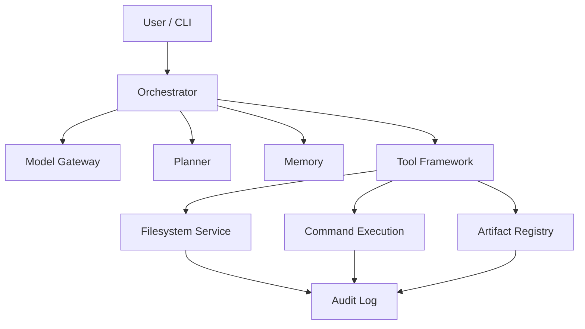

# Qwen3CoderNext

A local-first coding agent framework — Codex-style repository automation, without handing your codebase to a black box.

**Your repo. Your machine. Your rules.**


<!-- TODO: hero GIF/screenshot of the agent running a real task -->

---

## Why This Exists

Most "AI coding agent" tools force a trade you shouldn't have to make: ship your repository to a vendor's cloud, or give up on autonomous workflows entirely.

- Your code — and everything around it, env vars, internal tools, proprietary logic — leaves your machine.
- Execution is opaque. You can't audit what the agent actually did to your codebase.
- You're betting your workflow on one provider's roadmap, pricing, and uptime.
- Agent codebases that start clean tend to calcify into unmaintainable spaghetti before anyone proves the approach actually works.

Qwen3CoderNext exists because "autonomous" and "auditable" shouldn't be opposites. It's a coding agent foundation that runs on infrastructure you control, where every read, write, and command is logged, checksummed, and replayable.

## What Makes It Different

| | Typical Cloud Coding Agents | Qwen3CoderNext |
|---|---|---|
| **Where it runs** | Vendor's cloud | Your machine / your infra |
| **Execution visibility** | Opaque | Append-only, sequence-numbered audit log |
| **Repo boundaries** | Implicit, trust-based | Explicitly enforced |
| **Generated files** | Ephemeral | Checksum-verified, versioned, provenance-tracked |
| **Provider lock-in** | High | Model-gateway abstraction — swap providers freely |
| **Build philosophy** | Ship autonomy, bolt on reliability later | Deterministic infrastructure first, intelligence layered on top |

## Key Features

- **Local-first execution** — your repository and credentials never have to leave your machine.
- **Enforced workspace boundaries** — the agent physically can't wander outside the repo it's working in.
- **Safe, reversible file operations** — reads, patches, and writes go through a controlled pipeline, not raw filesystem access.
- **Full audit trail** — every action is append-only logged and replayable, so you always know what happened and why.
- **Provenance-tracked artifacts** — every generated file is checksum-verified with a supersede history, never silently overwritten.
- **Provider-independent model gateway** — change models without rearchitecting your workflow.
- **Built to be understood** — modular, contract-driven components instead of one sprawling agent loop.

## Architecture Overview



- **Orchestrator** — coordinates planning, memory, and tool execution for each task.
- **Model Gateway** — routes requests to any supported model provider.
- **Planner** — breaks tasks into executable steps (foundation in place; advanced planning is on the roadmap).
- **Tool Framework** — the contract layer every tool implements (filesystem, command execution, artifacts).
- **Filesystem Service** — enforces workspace boundaries and handles safe reads, writes, and patches.
- **Artifact Registry** — tracks every generated file with checksums and provenance.
- **Audit Log** — append-only, sequence-numbered record of everything the agent did.

## Example Workflow

1. **You ask:** "Refactor the auth module to use the new session interface."
2. **Internally:** the orchestrator plans the change, the filesystem service reads the relevant files inside the enforced workspace boundary, a patch is generated and applied, and every step lands in the audit log.
3. **You get:** a diff you can review, an artifact entry with a checksum, and a full audit trail of exactly what was read, changed, and run — before anything touches your main branch.

## Installation

```bash
git clone https://github.com/<your-org>/qwen3codernext.git
cd qwen3codernext
uv sync
```

## Quick Start

```bash
uv run python -m unittest discover -s tests -v
```

That's the test suite — 104 passing, 0 failing, as of today. Agent CLI entrypoints land as Agent Core development continues; this is the fastest way to see the foundation working right now.

## Repository Structure

> Illustrative — mirrors the components described above.

```
qwen3codernext/
├── src/
│   ├── core/          # Contracts, config, logging, state
│   ├── runtime/        # Bootstrap, orchestrator, runtime context
│   ├── tools/           # Tool framework + adapters
│   ├── fs/                # Workspace resolution, safe reads/writes, patching
│   ├── artifacts/    # Artifact registry, provenance, checksums
│   ├── audit/           # Append-only audit logging
│   ├── memory/        # Memory foundation
│   └── planning/      # Planning foundation
└── tests/                 # 104 tests, full suite
```

## Roadmap

**✅ Completed**
- Foundation Layer — contracts, config, logging, state, model gateway, orchestrator, artifact management
- Local Tooling Layer — filesystem service, safe reads/writes, command execution, artifact registry, audit logging

**🚧 In Progress**
- Agent Core

**📋 Planned**
- Advanced Planning
- Memory Systems
- Tool Ecosystem
- Repository Intelligence
- Autonomous Development Workflows
- Multi-Agent Architecture

## Screenshots / Demo

> No screenshots or demo yet — this project is foundation-first by design. A terminal walkthrough and architecture diagram are natural next additions once Agent Core lands.

## Use Cases

- **Privacy-conscious developers** who don't want proprietary code touching a third-party cloud.
- **Teams under compliance constraints** who legally can't use opaque cloud agents at all.
- **OSS maintainers** who want reproducible, auditable automation in CI without a vendor dependency.
- **Builders and researchers** who want a clean, contract-driven foundation to build agent behavior on top of, instead of forking a monolith.

## Why Developers Star This Project

- It's solving the actually hard problem — deterministic, auditable infrastructure — instead of skipping straight to a flashy agent loop.
- 104 passing tests at this stage means the foundation is real, not aspirational.
- Provider independence means you're not betting your workflow on one company's API.
- The architecture is intentionally legible — every subsystem has a single, named job.

## Contributing

Qwen3CoderNext is early, which means contributing now shapes the foundation, not just adds to it.

- Open an issue to discuss architecture or propose a feature before sending a large PR.
- Check the Roadmap's "In Progress" section for active work.
- Tests are mandatory — every subsystem ships with coverage.

Detailed contribution guidelines are coming as the project matures.

## Vision

Qwen3CoderNext is being built in the opposite order most agent projects choose: infrastructure first, intelligence second. The long-term goal is a fully autonomous, multi-agent development platform — repository understanding, persistent memory, multi-model collaboration — that never asks you to give up visibility into what it's doing or where your code lives.

## License

License to be determined.
