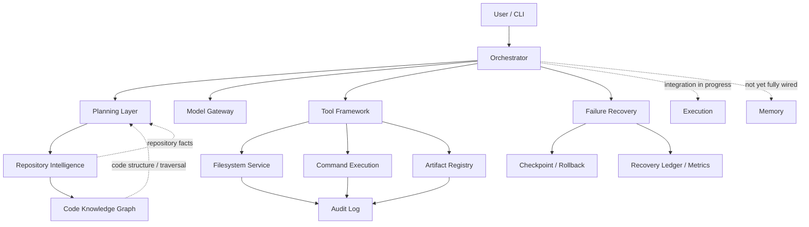

<div align="center">

<br/>

# Qwen3CoderNext

### A local-first coding agent framework — Codex-style repository automation, without handing your codebase to a black box.

<br/>

**Your repo. Your machine. Your rules.**

<br/>

[](https://github.com/neural-agi/Qwen3-coder-next)
[](https://github.com/neural-agi/Qwen3-coder-next/tree/main/tests)
[](https://python.org)
[](LICENSE)
[](https://github.com/astral-sh/uv)

<!-- TODO: Add CI badge once GitHub Actions is configured -->

<br/>

**[🤔 Why This Exists](#-why-this-exists) · [✨ What Makes It Different](#-what-makes-it-different) · [🏗 Architecture](#-architecture-overview) · [📦 Install](#-installation) · [🗺 Roadmap](#-roadmap) · [🤝 Contributing](#-contributing)**

</div>

---

## 🤔 Why This Exists

Every major AI coding agent forces the same trade-off: ship your repository to a vendor's cloud, or give up autonomous workflows entirely.

That trade-off is unnecessary. And it's expensive:

- Your code — env vars, internal tooling, proprietary logic — leaves your machine
- Execution is opaque. You can't audit what the agent actually did to your codebase
- You're locked to one provider's roadmap, pricing, and uptime
- Most agent codebases calcify into unmaintainable spaghetti before the approach is even proven

**Qwen3CoderNext exists because "autonomous" and "auditable" shouldn't be opposites.**

It's a coding agent foundation built on infrastructure you control, where every read, write, and command is logged, checksummed, and replayable — before any autonomous behavior is layered on top.

---

## 📍 Current Development Status

This project is under active development, built incrementally with a completed-layer-first discipline.

**Completed:**
- Foundation Layer
- Local Tooling Layer
- Planning Layer
- Failure Recovery Layer — Steps 1-9 complete
- Repository Intelligence — Part 9 Steps 1-9 complete
- Code Knowledge Graph — Part 10 Steps 1-7 complete

**Current focus:**
- Agent Core
- Execution Layer
- Repository Intelligence and Graph integration into runtime workflows
- Evaluation Layer integration

---

## ✨ What Makes It Different

|  | Typical Cloud Coding Agents | Qwen3CoderNext |
|---|---|---|
| **Where it runs** | Vendor's cloud | Your machine / your infra |
| **Execution visibility** | Opaque | Append-only, sequence-numbered audit log |
| **Repo boundaries** | Implicit, trust-based | Explicitly enforced |
| **Generated files** | Ephemeral | Checksum-verified, versioned, provenance-tracked |
| **Provider lock-in** | High | Model-gateway abstraction — swap providers freely |
| **Build philosophy** | Ship autonomy, bolt on reliability later | Deterministic infrastructure first, intelligence layered on top |

---

## 🔑 Key Features

- **Local-first execution** — your repository and credentials never have to leave your machine
- **Enforced workspace boundaries** — the agent physically can't wander outside the repo it's working in
- **Safe, reversible file operations** — reads, patches, and writes go through a controlled pipeline, not raw filesystem access
- **Full audit trail** — every action is append-only logged and replayable, so you always know what happened and why
- **Provenance-tracked artifacts** — every generated file is checksum-verified with a supersede history, never silently overwritten
- **Provider-independent model gateway** — change models without rearchitecting your workflow
- **Built to be understood** — modular, contract-driven components instead of one sprawling agent loop

---

## 🏗 Architecture Overview


```mermaid
flowchart TD
    U[User / CLI] --> O[Orchestrator]

    O --> PL[Planning Layer]
    O --> MG[Model Gateway]
    O --> TF[Tool Framework]

    PL --> RI[Repository Intelligence]
    RI --> KG[Code Knowledge Graph]

    TF --> FS[Filesystem Service]
    TF --> CMD[Command Execution]
    TF --> AR[Artifact Registry]

    FS --> AL[Audit Log]
    CMD --> AL
    AR --> AL

    O --> FR[Failure Recovery]
    FR --> CP[Checkpoint / Rollback]
    FR --> LED[Recovery Ledger / Metrics]

    RI -.->|repository facts| PL
    KG -.->|code structure / traversal| PL

    O -.->|integration in progress| EX[Execution]
    O -.->|not yet fully wired| MEM[Memory]
```

> **Solid lines** = implemented, validated, and available as project components.
> **Dashed lines** = implemented boundaries that are not yet fully wired into the runtime agent loop.

**Component breakdown:**

| Component | Role | Status |
|---|---|---|
| **Orchestrator** | Coordinates planning, tools, recovery, and runtime execution boundaries | ✅ |
| **Planning Layer** | Request normalization, task decomposition, dependency resolution, artifact generation | ✅ |
| **Model Gateway** | Routes requests across supported model providers | ✅ |
| **Tool Framework** | Contract, registry, manager, and tool adapter infrastructure | ✅ |
| **Filesystem Service** | Workspace boundaries, safe reads/writes, patches, and diffs | ✅ |
| **Artifact Registry** | Checksum, provenance, and supersede tracking for generated files | ✅ |
| **Audit Log** | Append-only, sequence-numbered action history | ✅ |
| **Failure Recovery** | Failure classification, strategy selection, bounded execution, checkpoint/rollback, ledger/metrics, scenario tests | ✅ |
| **Repository Intelligence** | Scanning, classification, dependency hints, summaries, persistence, incremental refresh, queries, fixture integration | ✅ |
| **Code Knowledge Graph** | Graph contracts, parser adapters, relation normalization, storage, traversal, invalidation, export | ✅ |
| **Memory** | Runtime-owned persistent context and working-memory infrastructure | 🚧 Integration pending |
| **Agent Core** | End-to-end task execution and runtime wiring across the completed layers | 🚧 Active |

---

## 📊 Current Status

### ✅ Foundation Layer — Complete

- Core contracts (artifact, model, runtime, state, task)
- Configuration system (settings, loader, defaults)
- Structured logging infrastructure
- State management (manager, store)
- Model gateway and adapter layer
- Runtime context and orchestrator shell
- Artifact manager and store
- Prompt infrastructure (contracts, loader, registry)
- Evaluation foundation

### ✅ Local Tooling Layer — Complete

- Workspace resolution and boundary enforcement
- Filesystem service abstraction
- Safe file reads, writes, and patch application
- Diff generation
- Command execution
- Artifact registry
- Audit logging
- Tool adapter integration

### ✅ Planning Layer — Complete

- Request normalization
- Task decomposition
- Dependency resolution
- Validation
- Planner state management
- Artifact generation
- Deterministic serialization
- Runtime integration

### ✅ Repository Intelligence — Complete

- Part 9 Steps 1-9 complete
- Immutable repository contracts and snapshot schema
- Deterministic repository scanning and ignore handling
- File classification and language detection
- Shallow dependency hint extraction
- File and folder summary generation
- Manifest persistence
- Incremental refresh and change journaling
- Snapshot-backed query service
- Fixture-driven end-to-end integration tests

### ✅ Code Knowledge Graph — Steps 1-7 Complete

- Immutable graph schemas and canonical IDs
- Parser adapter boundary with deterministic Python AST parsing
- Relation normalization and symbol resolution
- Persistent graph snapshot storage and publication
- Bounded deterministic graph traversal
- Invalidation and incremental reconciliation
- JSON, CSV, and text graph export

### 🚧 Agent Core — In Progress

- Wiring the completed layers into the orchestrator
- Building real end-to-end task execution
- Runtime integration of repository intelligence and graph services
- First complete CLI workflow

---

## 🎯 Target Experience

> *Agent Core is not yet complete. This is the full intended workflow once it lands.*

```
You: "Refactor the auth module to use the new session interface."
          │
          ▼
    Planning Layer
    (decomposition · dependency resolution · artifact generation)
          │
          ▼
    Research Layer
    (schemas · state · request normalization · source policy)
          │
          ▼
    Execution
    (controlled, audited, boundary-enforced)
          │
          ▼
    Local Tooling
    (filesystem reads · patch application · command execution)
          │
          ▼
    Audit Log
    (every action checksummed and replayable)
          │
          ▼
    Artifacts
    (provenance-tracked · versioned · never silently overwritten)
          │
          ▼
    Human Approval Gate
          │
          ▼
    Main Branch
```

---

## 📦 Installation

```bash
git clone https://github.com/neural-agi/Qwen3-coder-next.git
cd Qwen3-coder-next
uv sync
```

---

## 🧪 Quick Start

The fastest way to verify the foundation is solid while Agent Core is being built:

```bash
uv run python -m unittest discover -s tests -v
```

**329 tests. Zero failures.**

| Test Tier | Coverage |
|---|---|
| `tests/smoke/` | Deterministic subsystem and contract smoke tests — contracts, configuration, logging, state, tooling, planning, recovery, repository intelligence, graph foundations, runtime, and subsystem boundaries |
| `tests/unit/` | Deep subsystem-level tests — detailed coverage for local tooling and core infrastructure |
| `tests/integration/` | End-to-end integration coverage — local tooling and repository-intelligence integration flows |

---

## 📁 Repository Structure

```
Qwen-3-Coder-Next/
├── src/qwen3_coder_next/
│   ├── __main__.py              # CLI entry point
│   ├── adapters/                # model gateway, base adapter, exceptions
│   ├── artifacts/                # artifact manager and store
│   ├── bootstrap/                # app bootstrap, runtime initialization
│   ├── config/                   # settings, loader, defaults
│   ├── contracts/                # core type contracts — artifact, model, runtime, state, task
│   ├── evaluation/                # evaluation contracts, evaluator, simple_evaluator
│   ├── execution/                 # execution contracts and result types
│   ├── extractors/                # graph relation normalization and symbol resolution
│   ├── graph/                     # graph schemas, storage, traversal, invalidation, export
│   ├── local_tooling/             # filesystem, reads, mutations, diff, commands,
│   │                               # artifact registry, audit, resolution, adapter, contracts
│   ├── logging/                    # formatter, logger, setup
│   ├── memory/                     # schemas, state, contracts, manager, store
│   ├── parsers/                    # parser contracts and language adapters
│   ├── planning/                   # contracts, planner, decomposition, validation
│   ├── repo_intelligence/          # repository contracts, scanner, classifier, dependencies,
│   │                                # summaries, manifests, refresh, query services
│   ├── research/                   # research schemas, state, source policy, pipeline
│   ├── prompts/                    # contracts, loader, registry
│   ├── runtime/                    # orchestrator, runtime context
│   ├── state/                      # state manager and store
│   ├── tools/                      # contracts, registry, manager, echo_tool
│   └── utils/
│
├── tests/
│   ├── smoke/                   # Deterministic subsystem and contract smoke tests
│   ├── unit/                    # Deep subsystem-level tests
│   └── integration/             # End-to-end subsystem integration tests
│
├── documents/                   # internal architecture docs
│   ├── architecture.md
│   ├── vision.md
│   ├── roadmap.md
│   ├── coding_standards.md
│   ├── progress.md
│   └── session_handoff.md
│
├── Roadmap and Module wise expansion/   # 15 PDFs — full Tier 3 roadmap
│   ├── Part 1: Foundation
│   ├── Part 2: Filesystem + Local Tooling
│   ├── ... (Parts 3–14)
│   └── Part 15: Near-Codex Integrated System
│
├── logs/                        # application.log — the system already runs
├── pyproject.toml, uv.lock
└── README.md
```

---

## 📚 Documentation

**`documents/`** — Internal architecture specifications, coding standards, progress tracking, and session context. Start here before touching code.

**`Roadmap and Module wise expansion/`** — 15 PDFs covering the complete Tier 3 roadmap from Foundation through Near-Codex Integrated System. If you want to understand the layering decisions, start with the master roadmap PDF.

---

## 🗺 Roadmap

| Layer | Focus | Status |
|---|---|---|
| Foundation | Contracts, config, logging, state, model gateway, orchestrator, artifacts | ✅ Complete |
| Local Tooling | Filesystem, reads/writes, commands, audit, artifact registry | ✅ Complete |
| Planning Layer | Request normalization, task decomposition, dependency resolution, runtime integration | ✅ Complete |
| Failure Recovery | Failure classification, recovery strategy, execution, rollback, ledger/metrics, chaos validation | ✅ Complete |
| Repository Intelligence | Contracts, scanning, classification, dependency hints, summaries, persistence, refresh, queries, integration tests | ✅ Complete |
| Code Knowledge Graph | Graph contracts, parsing, normalization, storage, traversal, invalidation, export | ✅ Steps 1-7 |
| **Agent Core** | **Runtime integration, real task execution, CLI** | **🚧 Active** |
| Execution Layer | Controlled execution pipeline and autonomous task execution | 🚧 In Progress |
| Memory Layer | Persistent context, session memory, cross-task recall | 🚧 Integration pending |
| Autonomous Workflows | End-to-end task execution with human approval gates | 📋 Planned |
| Multi-Agent Architecture | Coordination, specialization, parallel execution | 📋 Planned |

The full 15-part roadmap is documented in `Roadmap and Module wise expansion/`.

---

## 👥 Who This Is For

**Privacy-conscious developers and teams** who can't or won't send proprietary code, internal tooling, or environment secrets to a third-party cloud agent.

**Teams under compliance constraints** — legal, financial, healthcare — where code leaving the machine isn't an option, but autonomous development workflows still are.

**OSS maintainers** who want reproducible, auditable automation in CI without a vendor dependency.

**Builders and researchers** who want a clean, contract-driven foundation to build agent behavior on top of — rather than forking an opinionated monolith and fighting its design assumptions.

---

## 🤝 Contributing

Qwen3CoderNext is early — contributing now means shaping the foundation, not just adding to it.

Read **[CONTRIBUTING.md](CONTRIBUTING.md)** for full setup instructions, coding guidelines, pull request expectations, and the project philosophy before opening anything.

**The short version:**
- Open an issue before large changes — architecture decisions need to stay consistent with existing contracts
- Tests are not optional — every subsystem has smoke, unit, and integration coverage; PRs that reduce coverage don't merge
- Read the relevant `documents/` spec and roadmap PDF for the module you're touching — it saves significant back-and-forth

**Where to contribute right now:**

| Area | What's Needed |
|---|---|
| 🚧 **Agent Core** | Orchestrator integration, end-to-end task execution, memory wiring, CLI entrypoint |
| 🚧 **Repository / Graph Integration** | Connect repository intelligence and graph services to runtime workflows |
| 🧪 **Test Coverage** | Additional integration, regression, and end-to-end tests across completed layers |
| 📚 **Documentation** | Architecture docs, setup guides, examples, and subsystem documentation |

---

## 💡 Design Philosophy

> Most agent projects ship a capable-looking agent first and try to add reliability later. The result is an autonomous system that's hard to trust, hard to debug, and hard to extend — because the foundation wasn't built for those properties.

Qwen3CoderNext takes the opposite path: **deterministic, testable infrastructure first.** Every subsystem is validated before the next layer is added. Every layer is completed, validated, and frozen before higher-level systems are allowed to depend on it.

The long-term target is a fully autonomous, multi-agent development platform — repository understanding, persistent memory, multi-model collaboration, human approval gates — that never asks you to give up visibility into what it's doing or where your code lives.

**329 automated tests. Deterministic infrastructure. Failure Recovery Steps 1-9 complete; Repository Intelligence Steps 1-9 and Part 10 Steps 1-7 graph foundations are implemented.**

---

## 📄 License

Qwen3CoderNext is licensed under the **MIT License**.

You're free to use, modify, distribute, and build upon this project in accordance with the terms of the license.

See the [LICENSE](LICENSE) file for the full license text.

---

<div align="center">

Built by [@neural-agi](https://github.com/neural-agi)

[](https://github.com/neural-agi/Qwen3-coder-next)
[](https://github.com/neural-agi/Qwen3-coder-next/fork)
[](https://github.com/neural-agi/Qwen3-coder-next)

</div>
